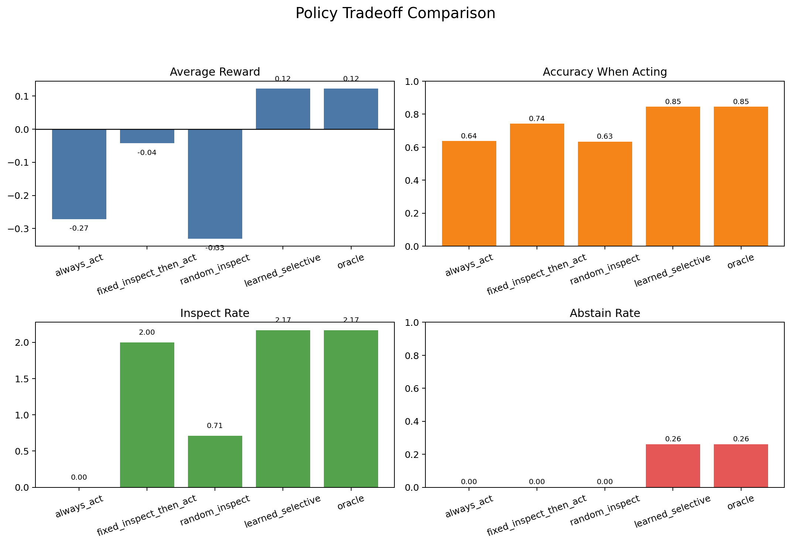

# selective-reasoning-lab: when should a model act, abstain, or ask for more evidence?

## A compact testbed for uncertainty-aware selective reasoning in a partially observable environment

`selective-reasoning-lab` is a small research prototype for studying when a model should act, abstain, or gather more information before acting. The project does not claim novelty in uncertainty estimation. Its purpose is to provide a controlled, interpretable setting in which uncertainty is behaviorally consequential rather than merely diagnostic.

## Motivation

Most predictive systems are evaluated on whether they output the right label. That misses an important decision problem: a model may know enough to act, know too little and need more evidence, or know so little that abstention is safer than forced prediction. This repository studies that selective reasoning problem in a setting small enough to inspect directly.

## Central Research Question

Can a lightweight model learn not only to predict hidden state from partial observations, but also to recognize when its internal state is insufficiently certain and adapt by acting, inspecting further, or abstaining?

## Core Claim

Raw prediction quality is not the whole problem. In a partially observable setting, a useful model should recognize when its internal state is too uncertain for immediate action and should convert that uncertainty into selective behavior: act when evidence is strong, inspect when extra information has value, and abstain when uncertainty remains too high.

## Environment

The environment is a tiny sequential diagnosis task.

- The hidden world state has three classes.
- The agent begins with one free observation.
- Each additional `inspect` action reveals another noisy symbol at a small cost.
- At any point the agent may:
  - `act` by predicting the hidden class,
  - `inspect` to obtain another observation,
  - `abstain` and accept a moderate penalty.

The observation model is intentionally overlapping:

- state 0: `(0.70, 0.20, 0.10)`
- state 1: `(0.28, 0.44, 0.28)`
- state 2: `(0.10, 0.20, 0.70)`

Reward structure:

- correct act: `+1.0`
- wrong act: `-2.5`
- inspect: `-0.07`
- abstain: `-0.25`

This creates a genuine tradeoff. Strong early evidence can justify immediate action. Ambiguous evidence can justify further inspection. Persistently ambiguous evidence can make abstention optimal.

## Why Uncertainty Matters Here

Uncertainty is not decorative in this setup. The same predictive model can behave very differently depending on whether it treats low-confidence states as permissionless action, as a cue to gather more evidence, or as a reason to defer. The value of uncertainty is therefore measured in utility, coverage, and error avoidance, not only in calibration plots.

## Model Overview

The model is intentionally small:

- `ObservationEncoder`: an embedding layer plus a one-layer GRU over observation history.
- `Prediction head`: predicts the hidden state.
- `Decision head`: predicts `act`, `inspect`, or `abstain`.
- `Uncertainty module`: Monte Carlo dropout over the encoder and heads to estimate predictive entropy and disagreement.

The project includes both:

- a learned selective policy trained to imitate the oracle meta-decision,
- an uncertainty-threshold policy that exposes the act/inspect/abstain tradeoff directly.

## Training Setup

Training is supervised rather than RL-heavy.

- Offline trajectories are generated from the known environment.
- For each observation prefix, an exact Bayesian oracle computes:
  - posterior over hidden states,
  - optimal meta-decision via finite-horizon dynamic programming,
  - expected values for `act`, `inspect`, and `abstain`.
- The model is trained on two targets:
  - hidden state classification,
  - oracle meta-decision classification.

This keeps the project compact while preserving a meaningful decision problem.

## Experiments

The code runs six compact analyses:

1. Prediction quality
   Measures hidden-state accuracy, balanced accuracy, and Brier score.
2. Calibration and uncertainty quality
   Measures ECE and plots uncertainty against empirical error.
3. Selective decision performance
   Evaluates act accuracy, inspect frequency, abstention rate, and average reward.
4. Tradeoff analysis
   Sweeps an uncertainty threshold to show how coverage, abstention, inspection, and reward move together.
5. Baseline comparison
   Compares the learned selective policy against always-act, fixed-inspect, and random-inspect baselines.
6. Failure analysis
   Extracts overconfident errors and visualizes at least one failure trajectory.

## Key Results

Default run on the included configuration:

- Prediction accuracy: `0.662`
- Balanced accuracy: `0.665`
- Brier score: `0.444`
- Calibration error (ECE): `0.019`
- Overconfident wrong prefix predictions: `311`

Policy results:

- always act: reward `-0.272`, act accuracy `0.637`
- fixed inspect then act: reward `-0.043`, act accuracy `0.742`
- random inspect: reward `-0.331`, act accuracy `0.634`
- learned selective policy: reward `0.122`, act accuracy `0.845`, act rate `0.74`, abstain rate `0.26`

In this compact environment, the learned selective policy matches the oracle policy on the evaluation set. That is a useful result for this prototype: even with only moderate raw classification accuracy, uncertainty-aware selective behavior substantially improves utility over naive baselines.



## Results Artifacts

Running `main.py` produces:

- `results/figures/training_curves.png`
- `results/figures/calibration_curve.png`
- `results/figures/uncertainty_vs_error.png`
- `results/figures/threshold_tradeoff.png`
- `results/figures/baseline_policy_comparison.png`
- `results/figures/trajectory_examples.png`
- `results/figures/failure_case.png`

## Repository Layout

```text
selective-reasoning-lab/
  README.md
  PROJECT_SUMMARY.md
  requirements.txt
  config.py
  main.py
  generate_data.py
  train.py
  evaluate.py
  analyze_uncertainty.py
  policy_eval.py
  environments/
    __init__.py
    environment.py
    rules.py
  models/
    __init__.py
    encoder.py
    uncertainty.py
    decision_model.py
  utils/
    __init__.py
    seed.py
    metrics.py
    plotting.py
    data_utils.py
  results/
    checkpoints/
    figures/
  notebooks/
```

## Running Locally

```bash
python3 -m venv .venv
./.venv/bin/python -m pip install -r requirements.txt
./.venv/bin/python main.py
```

The top-level script regenerates data, trains the model, runs evaluation, and writes figures and JSON metrics under `results/`.

## Limitations

- The environment is deliberately small and stylized.
- The oracle labels are exact, which makes the meta-decision problem cleaner than most real deployments.
- The decision head reaches perfect oracle-action accuracy on this setup, which reflects the simplicity and interpretability of the environment rather than a general claim about selective reasoning.
- Monte Carlo dropout is used as a lightweight uncertainty proxy; the project does not compare multiple uncertainty estimators.

## Future Directions

- Replace the i.i.d. observation process with multiple sensor types or action-conditioned observations.
- Introduce shift between training and evaluation observation statistics.
- Compare Monte Carlo dropout against small ensembles or explicit variance heads.
- Study whether selective behavior remains robust when the oracle is only approximate.
